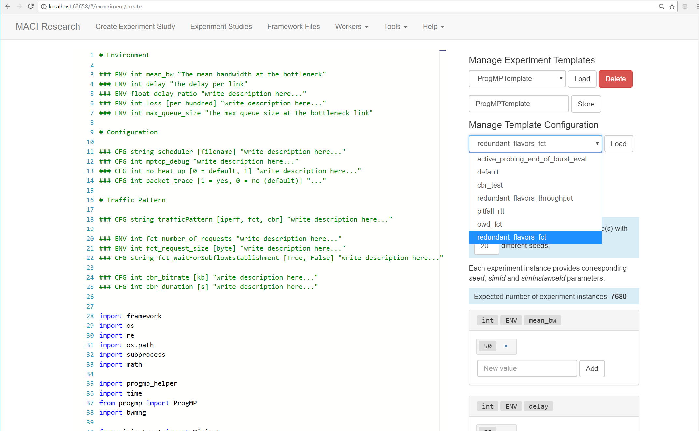

# ProgMP Evaluation Setup for MACI

This repository contains an evaluation setup for various [ProgMP](https://progmp.net) Multipath TCP scheduler. 
The setup includes throughput experiments, flow completion time experiments, and constant bitrate experiments for ProgMP schedulers such as redundant schedulers, active probing schedulers, and one-way delay-aware schedulers.
The evaluation setup relies on [MACI](https://maci-research.net). 

## Getting Started

1. Get a running [MACI](https://maci-research.net) instance
2. Clone this repository into your MACI project folder
3. Open this project in MACI to get started.

The following screenshot illustrates the available experiments in MACI.

